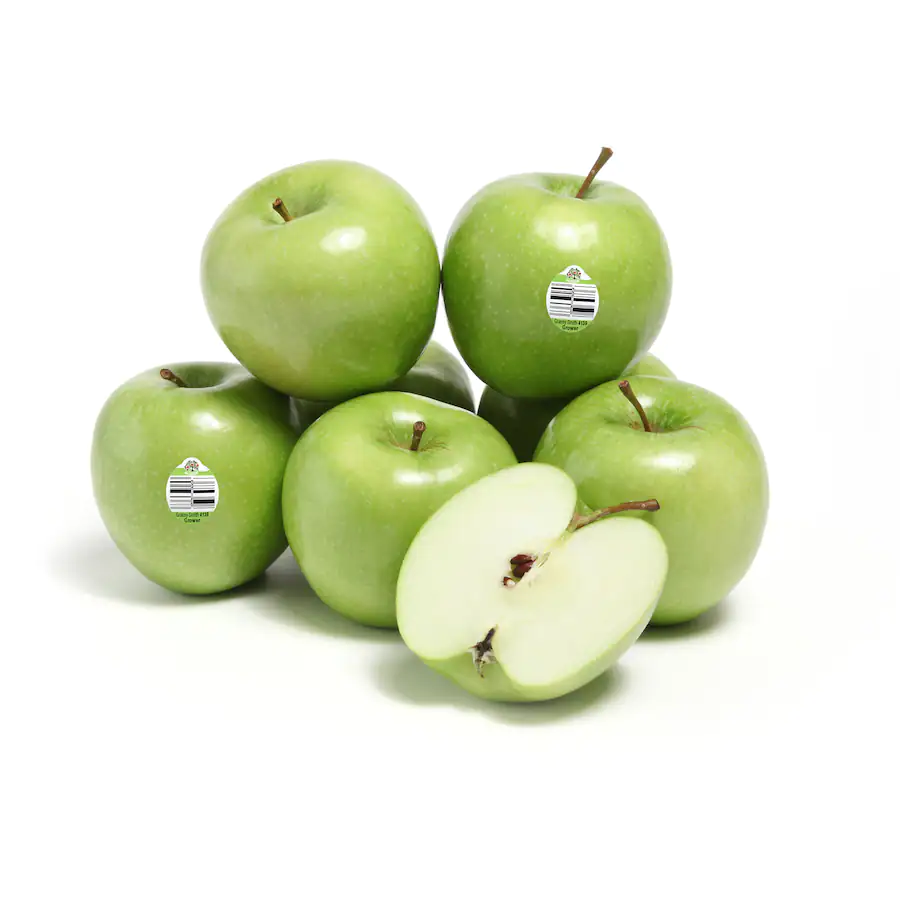

##################################
Tutorial 2 of Sphinx documentation
##################################

Introduction
============
This is a really cool workshop, hosted by the *ABI's* in-house software developer, **Chinchien Lin**.

He is giving this workshop as part of the *Animus Laboratory*, led by **Dr. Gonzalo Maso Talou**.

Main content
============
**Ex 1:** Favourite restaurants around the ABI

- Cubik
- Little Turkish Cafe
- Uncle Man's

**Ex 2:** Top 3 favourite movies:

1. Shawshank Redemption
2. The Godfather
3. Schindler's List

**Ex 3:**
See `GitHub <https://github.com>`_ here.

My favourite fruit is an apple.

Some code for Hello Kitty:

.. code-block:: python

    name = 'Hello Kitty'
    print(name)

Conclusion
==========
Interesting workshop for sure.
